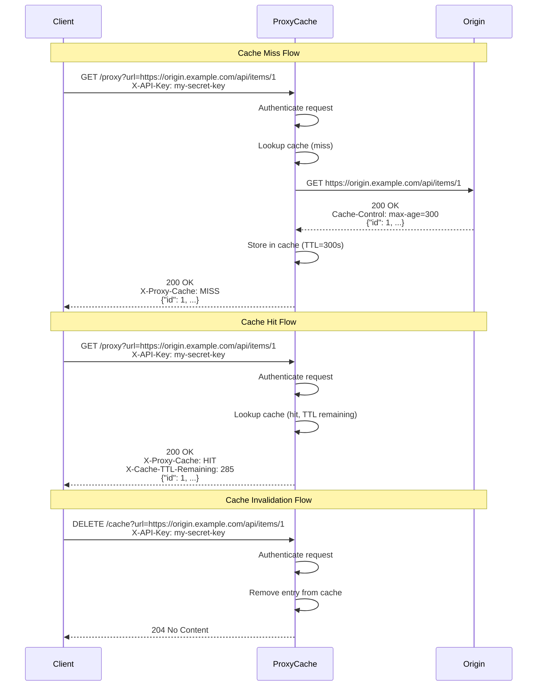

# Proxy Cache Microservice

An in-memory HTTP proxy cache built with Go, forwards requests to origin servers, caches responses based on `Cache-Control` headers, and serves cached responses on subsequent requests.

## Running the Service

```bash
cd service
go run . serve --port 8080 --api-key my-secret-key
```

The OpenAPI UI is available at `http://localhost:8080/swagger/index.html` while the service is running.

## Running the Test Client

```bash
cd test_client
go run . run --api-key my-secret-key
```

## Running Unit Tests

```bash
cd service
go test ./cmd/ -v
```

## UML Sequence Diagram

### Requesting and Receiving Data



## API Endpoints

All endpoints require authentication via the `X-API-Key` header (or `api_key` query parameter). Requests without a valid key receive `401 Unauthorized`.

### `GET /proxy`

Proxy a request through the cache.

| Parameter | In    | Description                          |
|-----------|-------|--------------------------------------|
| `url`     | query | The origin URL to fetch (required)   |

**Response Headers:**

| Header                  | Description                                        |
|-------------------------|----------------------------------------------------|
| `X-Proxy-Cache`         | `HIT` if served from cache, `MISS` if from origin  |
| `X-Cache-TTL-Remaining` | Seconds until the cached entry expires (HIT only)   |

### `DELETE /cache`

Purge a cached entry.

| Parameter | In    | Description                          |
|-----------|-------|--------------------------------------|
| `url`     | query | The cached URL to purge (required)   |

**Responses:** `204 No Content` on success, `404 Not Found` if no entry exists.

## Example Code

### Making a Request and Processing the Response

```go
package main

import (
	"encoding/json"
	"fmt"
	"io"
	"log"
	"net/http"
	"time"
)

func main() {
	client := &http.Client{Timeout: 10 * time.Second}
	targetURL := "https://jsonplaceholder.typicode.com/posts/1"

	// Build the request
	req, err := http.NewRequest(
		http.MethodGet,
		"http://localhost:8080/proxy?url="+targetURL,
		nil,
	)
	if err != nil {
		log.Fatal(err)
	}
	req.Header.Set("X-API-Key", "my-secret-key")

	// Send the request
	resp, err := client.Do(req)
	if err != nil {
		log.Fatal(err)
	}
	defer resp.Body.Close()

	// Check cache status from response headers
	cacheStatus := resp.Header.Get("X-Proxy-Cache") // "HIT" or "MISS"
	fmt.Println("Cache status:", cacheStatus)

	if cacheStatus == "HIT" {
		ttl := resp.Header.Get("X-Cache-TTL-Remaining")
		fmt.Println("TTL remaining:", ttl, "seconds")
	}

	// Read and parse the response body
	body, err := io.ReadAll(resp.Body)
	if err != nil {
		log.Fatal(err)
	}

	var post map[string]any
	json.Unmarshal(body, &post)
	fmt.Println("Title:", post["title"])
}
```

### Invalidating a Cached Entry

```go
req, _ := http.NewRequest(
    http.MethodDelete,
    "http://localhost:8080/cache?url="+targetURL,
    nil,
)
req.Header.Set("X-API-Key", "my-secret-key")

resp, err := client.Do(req)
if err != nil {
    log.Fatal(err)
}

if resp.StatusCode == http.StatusNoContent {
    fmt.Println("Cache entry purged")
} else if resp.StatusCode == http.StatusNotFound {
    fmt.Println("No cache entry found for that URL")
}
```

## OpenAPI Specification

The service uses go-fuego to auto-generate an OpenAPI 3.1.0 spec. Access it at `/swagger/openapi.json` while the service is running, or see the full spec below.

```json
{
  "openapi": "3.1.0",
  "info": {
    "title": "Proxy Cache API",
    "version": "0.0.1"
  },
  "servers": [
    {
      "description": "local server",
      "url": "http://localhost:8080"
    }
  ],
  "paths": {
    "/proxy": {
      "get": {
        "operationId": "GET_/proxy",
        "summary": "Proxy a request through the cache",
        "parameters": [
          {
            "name": "url",
            "in": "query",
            "required": true,
            "description": "The origin URL to proxy",
            "schema": { "type": "string" }
          },
          {
            "name": "X-API-Key",
            "in": "header",
            "required": true,
            "description": "API key for authentication",
            "schema": { "type": "string" }
          }
        ],
        "responses": {
          "200": {
            "description": "Origin response body (passed through unmodified)",
            "headers": {
              "X-Proxy-Cache": {
                "description": "HIT if served from cache, MISS if fetched from origin",
                "schema": { "type": "string", "enum": ["HIT", "MISS"] }
              },
              "X-Cache-TTL-Remaining": {
                "description": "Seconds until cached entry expires (present on HIT only)",
                "schema": { "type": "integer" }
              }
            }
          },
          "400": {
            "description": "Missing url query parameter"
          },
          "401": {
            "description": "Missing or invalid API key"
          },
          "502": {
            "description": "Failed to reach origin server"
          }
        }
      }
    },
    "/cache": {
      "delete": {
        "operationId": "DELETE_/cache",
        "summary": "Purge a cached entry",
        "parameters": [
          {
            "name": "url",
            "in": "query",
            "required": true,
            "description": "The cached URL to purge",
            "schema": { "type": "string" }
          },
          {
            "name": "X-API-Key",
            "in": "header",
            "required": true,
            "description": "API key for authentication",
            "schema": { "type": "string" }
          }
        ],
        "responses": {
          "204": {
            "description": "Cache entry successfully purged"
          },
          "401": {
            "description": "Missing or invalid API key"
          },
          "404": {
            "description": "No cache entry found for the given URL"
          }
        }
      }
    }
  }
}
```
